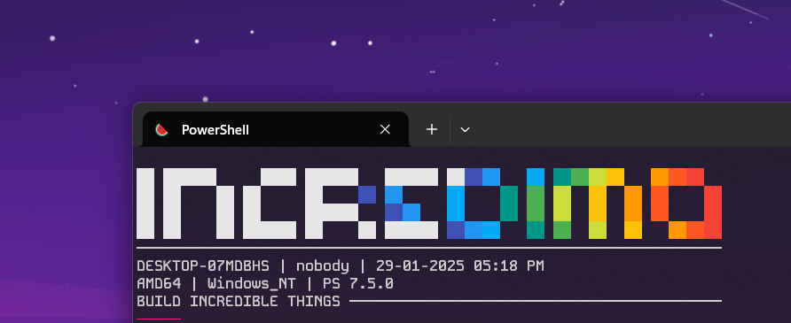

# Incredimo

dead simple banner generator


## Features

- Sometimes you just need a banner
- No ffi, no dependencies, no build system
- simple println! and call it a day 😉

## Example

```rust
use incredimo::Banner;

fn main() {
    let banner = Banner::new("INCREDIBLE")
        .with_colors()
        .with_subtitle("IMPOSSIBLE IS JUST A CHALLENGE YET TO BE SOLVED")
        .with_line_length(80)
        .build()
        .unwrap();
}
```
